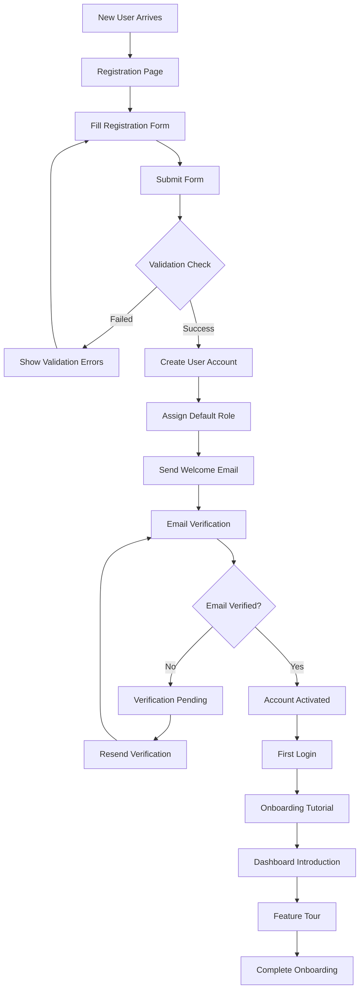
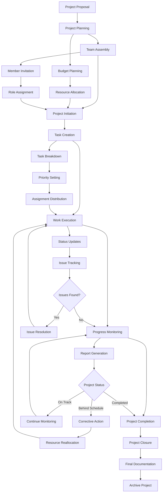
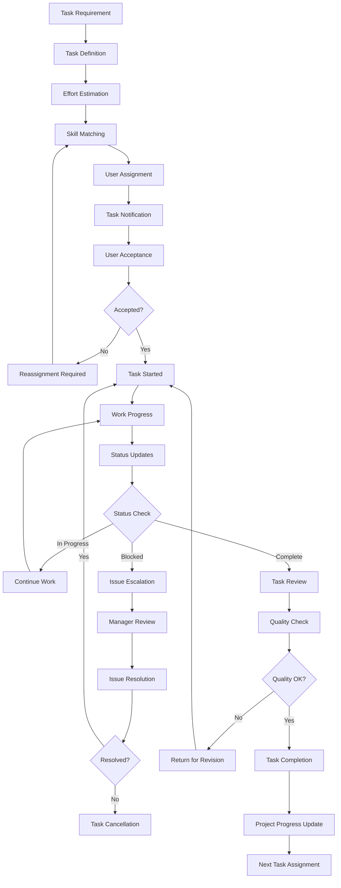
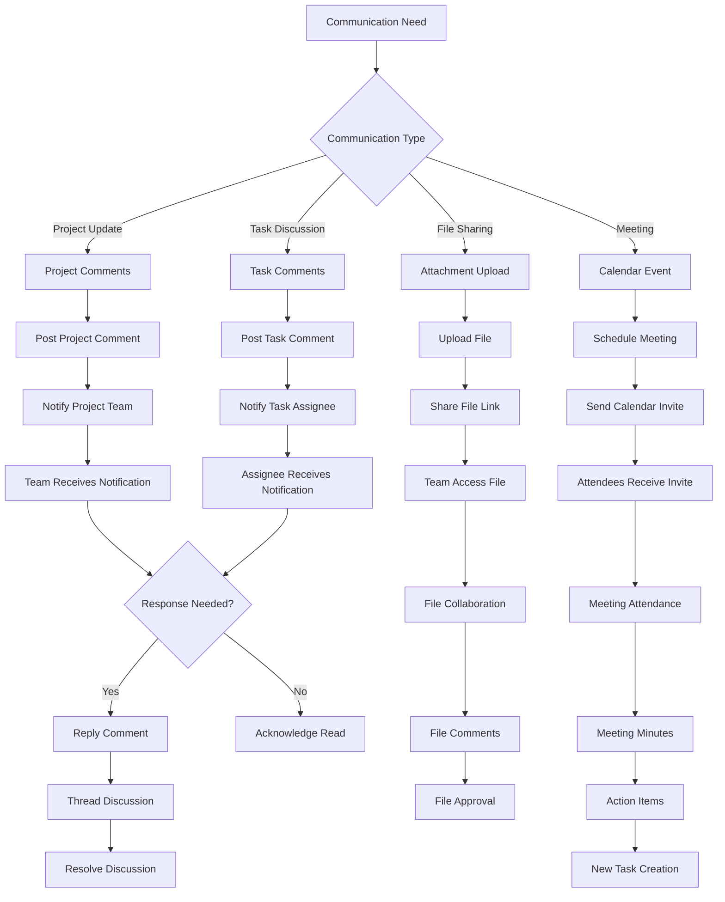
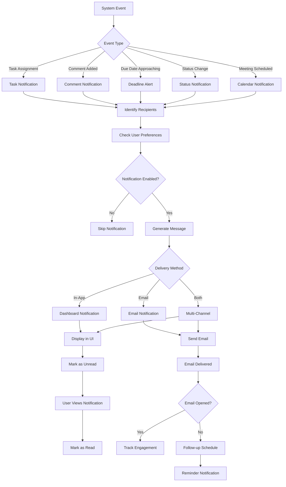
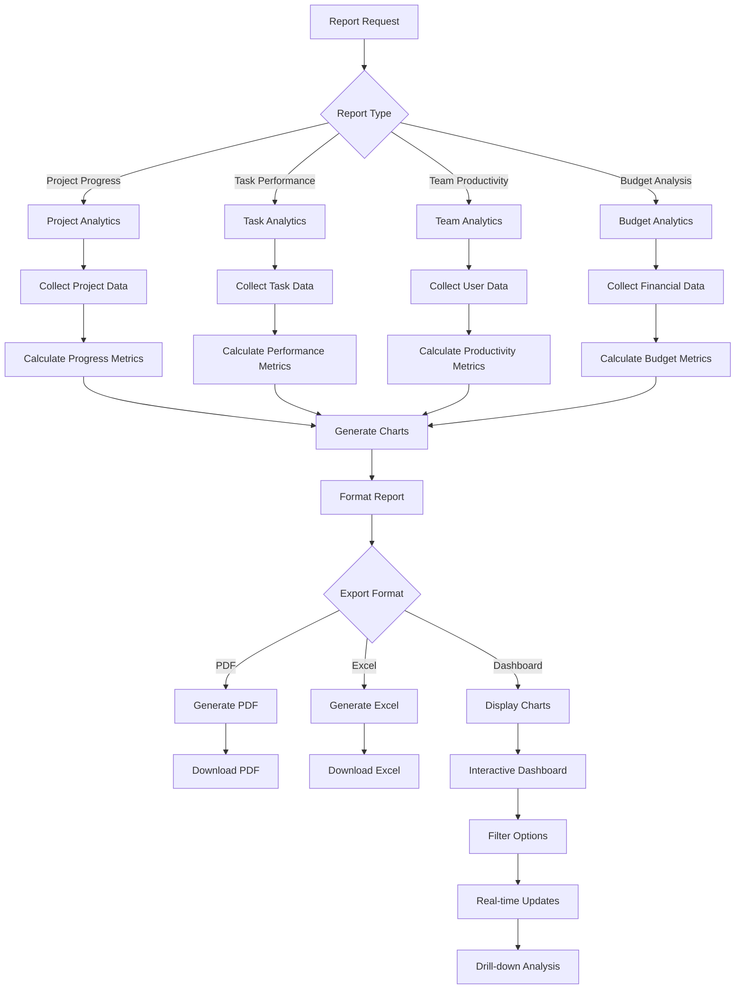
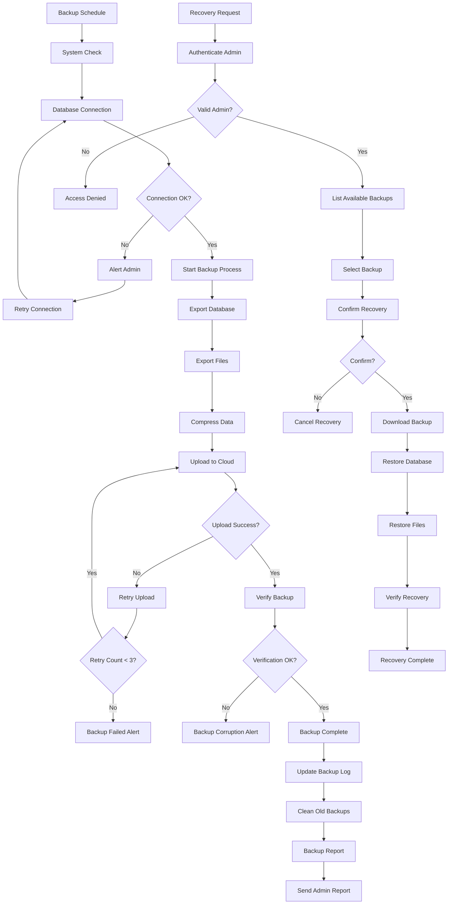
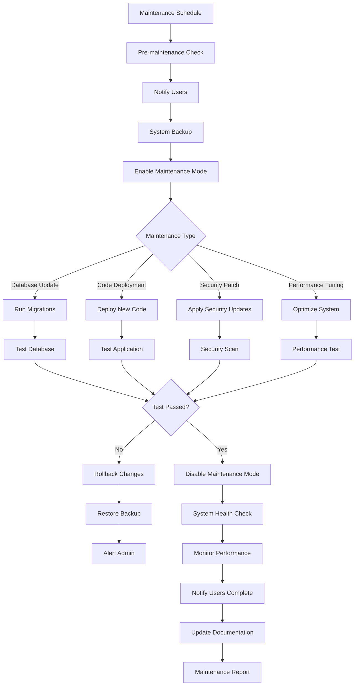

# Business Process Flowcharts

## Project Management System - User Journey & Business Flows

### 1. User Registration & Onboarding Flow

### 2. Project Lifecycle Management

### 3. Task Assignment & Execution Flow

### 4. Collaboration & Communication Flow

### 5. Notification & Alert System

### 6. Reporting & Analytics Flow

### 7. Data Backup & Recovery Flow

### 8. System Maintenance Flow

---

_Generated on: June 10, 2025_
_System: Project Management System_
_Documentation: Business Process Flowcharts_
