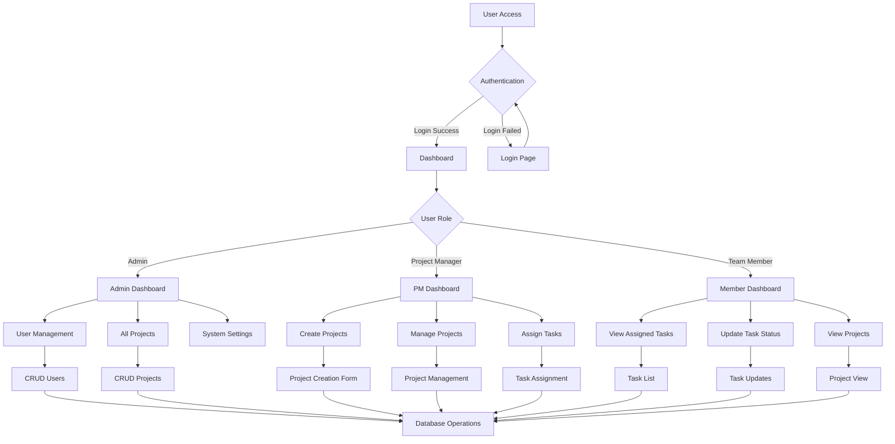
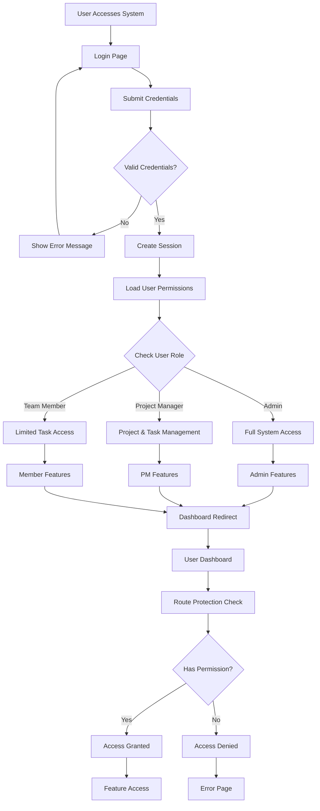
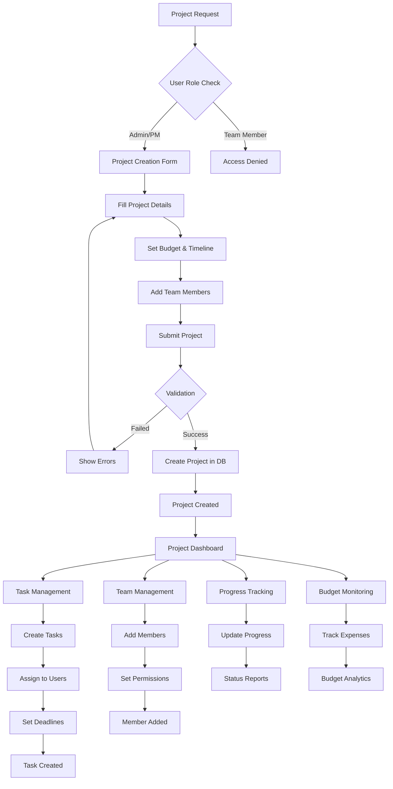
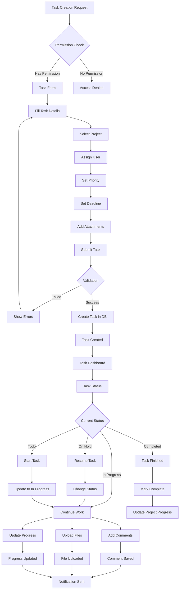
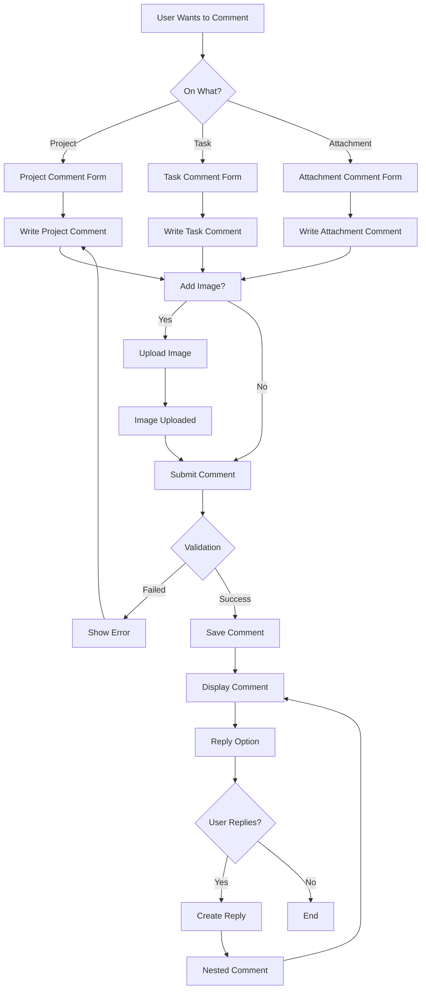
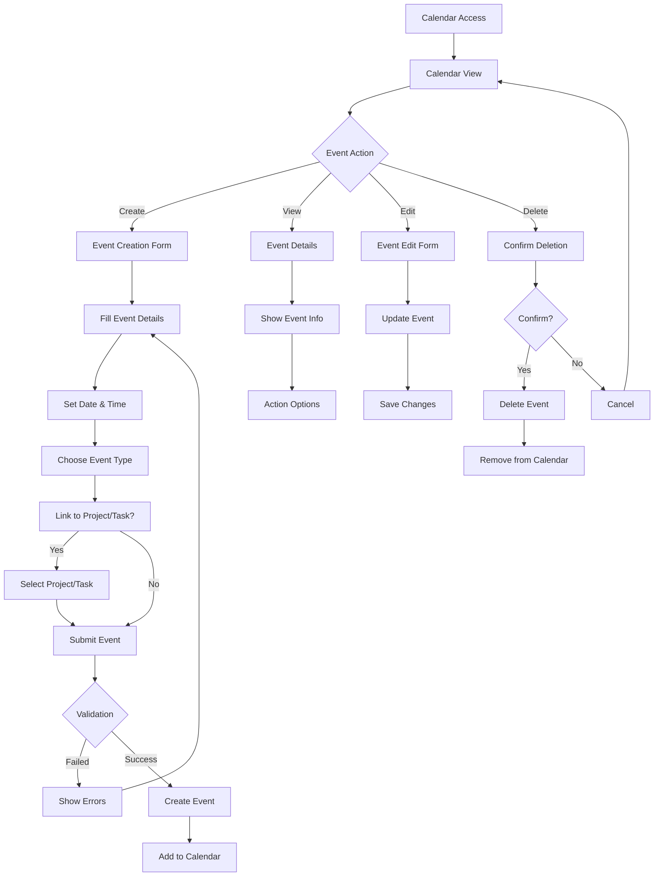
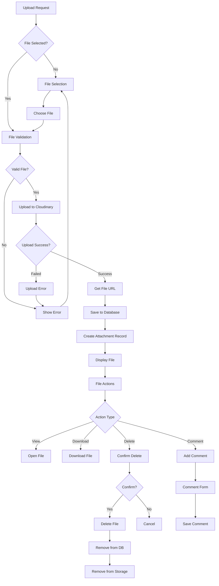
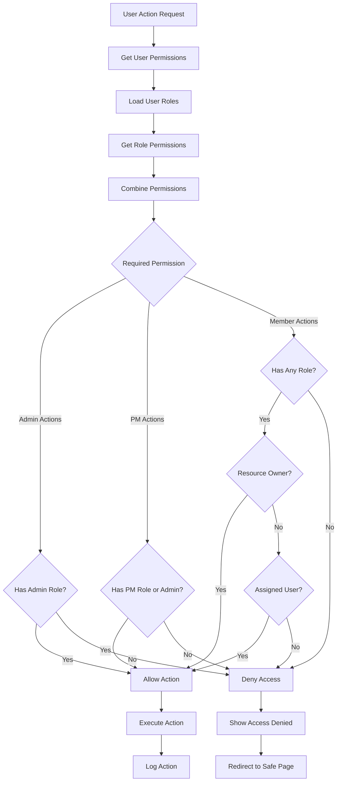
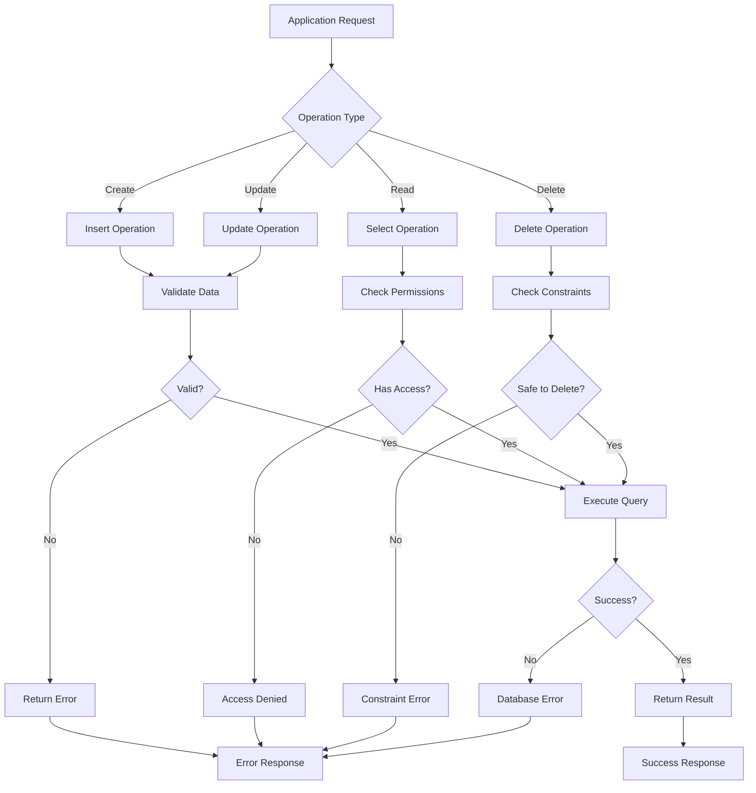
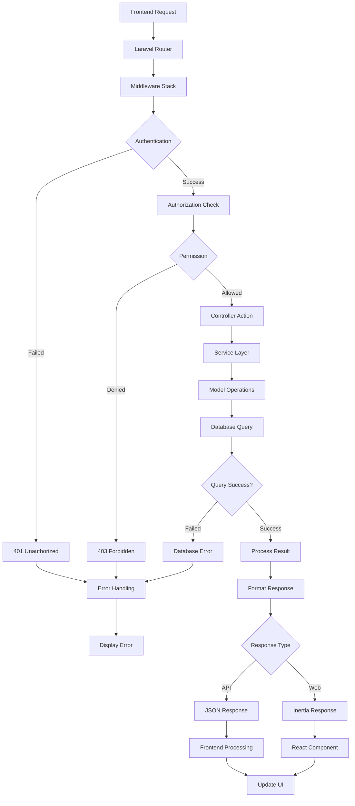

# System Flowchart Documentation
## Project Management System - Flow Diagrams

### 1. System Architecture Flowchart

### 2. User Authentication & Authorization Flow

### 3. Project Management Workflow

### 4. Task Management Flow

### 5. Comment System Flow

### 6. Calendar Events Flow

### 7. File Attachment Flow

### 8. Permission System Flow

### 9. Database Operation Flow

### 10. System Integration Flow

---

*Generated on: June 10, 2025*
*System: Project Management System*
*Documentation: Complete System Flowcharts*
